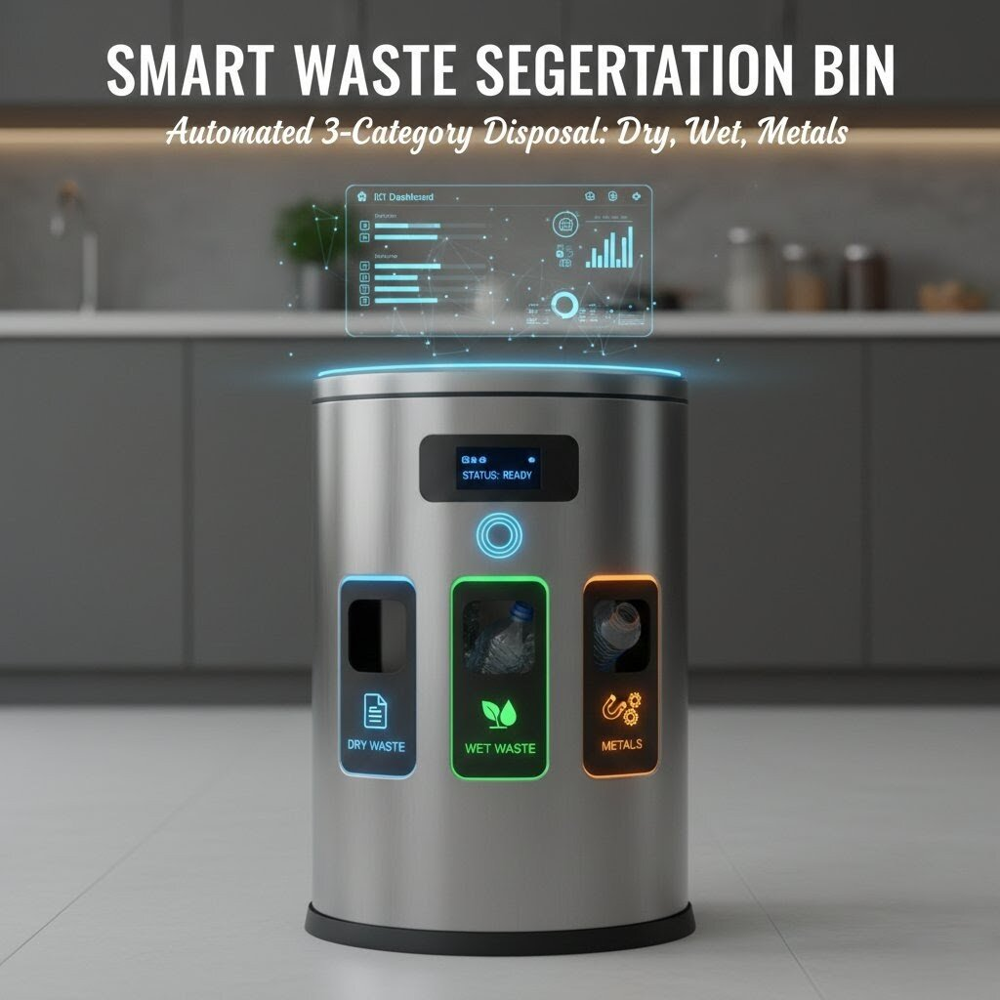

# Smart Waste Segregation Trash Can

An ESP8266 based smart trash can that automatically detects and separates waste into different bins using sensors and a rotating stepper motor mechanism.

## Overview

Waste segregation is an important step in improving recycling efficiency and reducing environmental pollution. This project automates the process by detecting different types of waste and directing them to the correct container automatically.

The system uses an inductive sensor to detect metal objects and a moisture sensor to identify wet waste. Based on the sensor readings, a stepper motor rotates the trash bin platform so that the waste falls into the correct compartment.

## Features

Automatic waste detection  
Metal detection using inductive sensor  
Wet and dry waste classification using moisture sensor  
Rotating bin system controlled by stepper motor  
ESP8266 microcontroller control  
Low cost and scalable design

## Components Used

ESP8266 (NodeMCU)  
Inductive Metal Sensor  
Moisture / Water Sensor  
Stepper Motor  
Stepper Motor Driver (ULN2003 / A4988 depending on motor)  
Power Supply  
Trash Can with multiple compartments  
Connecting wires

  

 

## Working Principle

1. Waste is placed in the input section of the trash can.
2. The inductive sensor checks if the object is metal.
3. If metal is detected, the stepper motor rotates the platform to the metal bin.
4. If metal is not detected, the moisture sensor checks the waste.
5. If moisture is detected, the waste is classified as wet waste.
6. If no moisture is detected, the waste is classified as dry waste.
7. The stepper motor rotates the trash bin to the correct compartment and drops the waste.

## Applications

Smart homes  
Smart cities  
Public waste management systems  
Recycling centers  
Educational robotics projects

## Future Improvements

Integration with IoT dashboards
Fill level monitoring using ultrasonic sensors 
AI based waste classification using camera modules  
Mobile app monitoring system

# Project Difficulty: Intermediate Embedded System

# Development Time: 1 Week

## Author

Embedded Systems Project by Jash.
